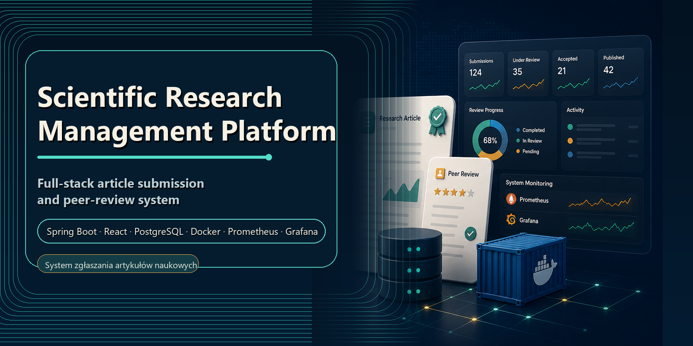
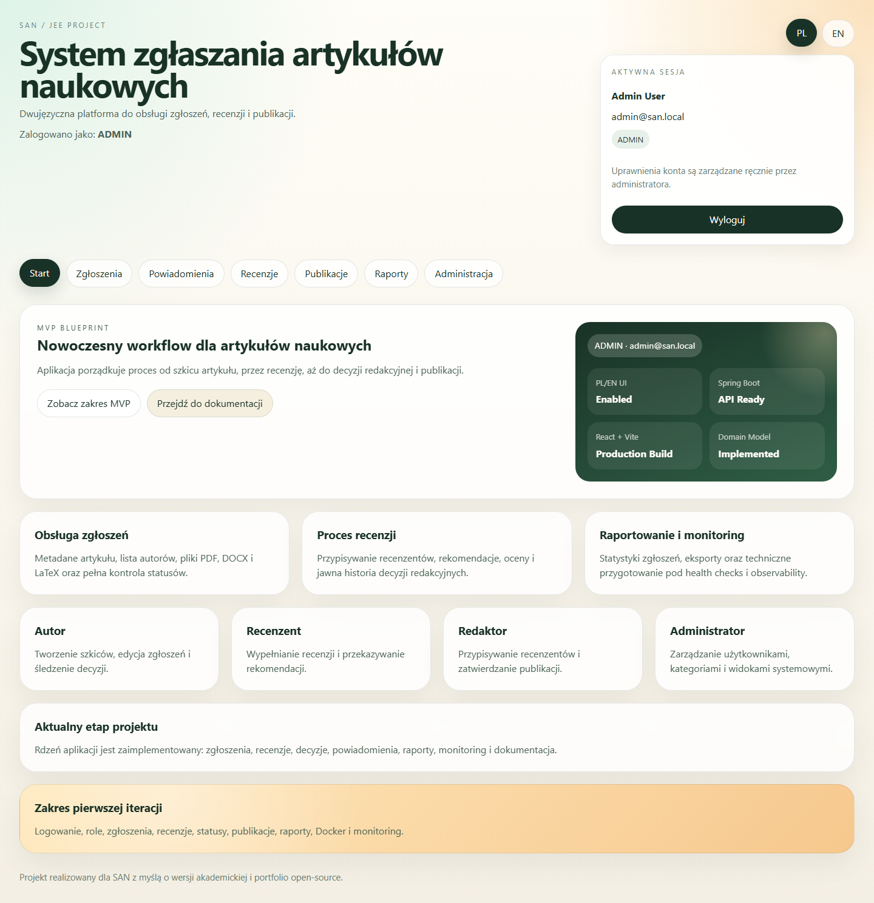
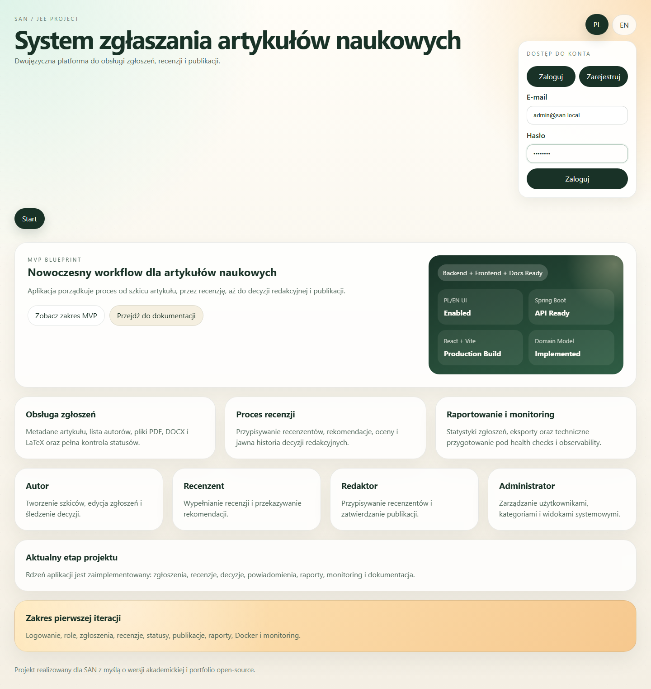
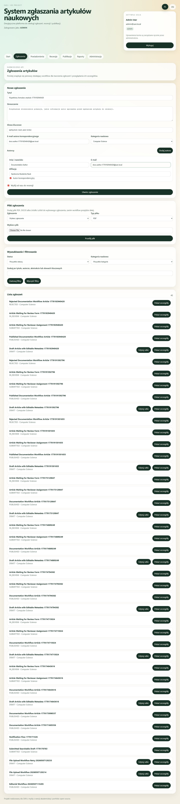
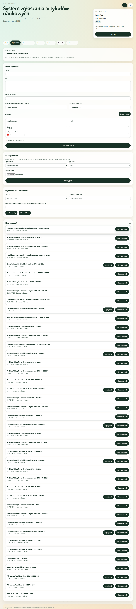
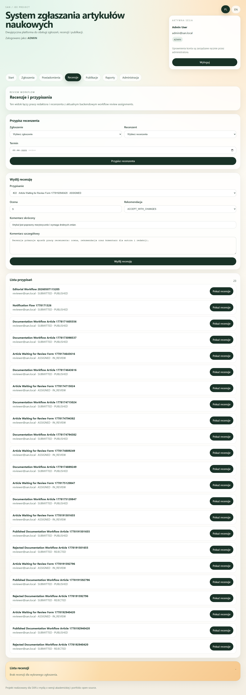
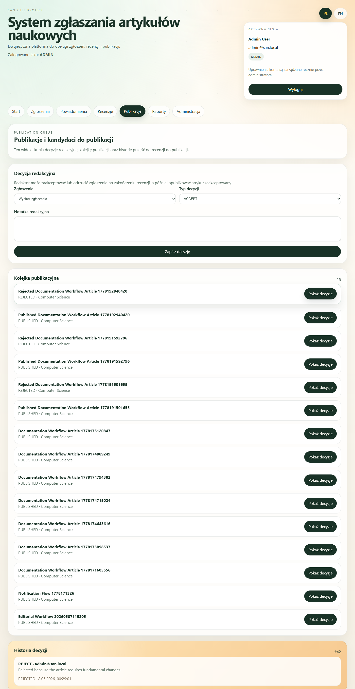
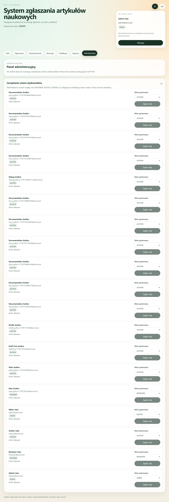
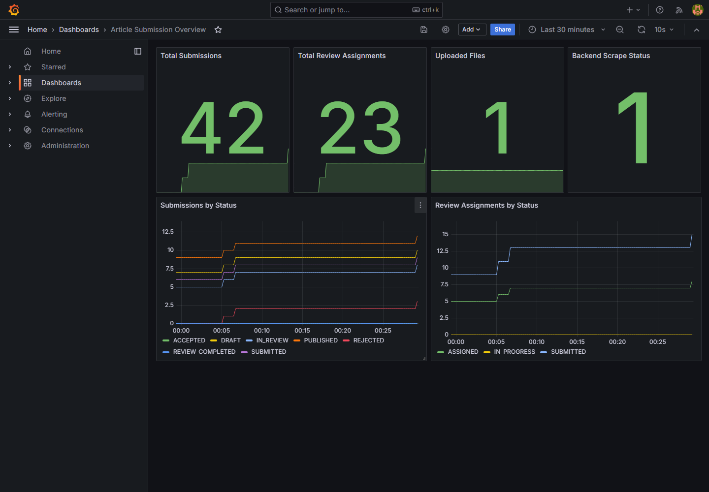

# Scientific Research Management Platform

> EN: A bilingual web application for submitting, reviewing, accepting, publishing, reporting and monitoring scientific articles.
>
> PL: Dwujęzyczna aplikacja webowa do zgłaszania, recenzowania, akceptowania, publikowania, raportowania i monitorowania artykułów naukowych.

University project title: `System zgłaszania artykułów naukowych`.



## EN Overview

This project was created as a JEE university project and as an open-source portfolio application. It implements a complete article submission workflow: frontend, backend, PostgreSQL database, Docker Compose environment, tests, monitoring, role-based administration, in-app notifications and operational exports.

The application is not only a static UI mock-up. The screenshots are generated from a running Docker environment, and the displayed statuses, assignments, decisions, notifications and reports come from real backend operations.

## PL Opis

Projekt powstał jako aplikacja na przedmiot JEE oraz jako projekt portfolio open-source. System obsługuje kompletny proces zgłaszania artykułów naukowych: frontend, backend, bazę PostgreSQL, środowisko Docker Compose, testy, monitoring, administrację rolami, powiadomienia wewnętrzne i eksporty operacyjne.

Aplikacja nie jest wyłącznie statycznym makietowym interfejsem. Zrzuty ekranu są generowane z działającego środowiska Docker, a widoczne statusy, przypisania, decyzje, powiadomienia i raporty wynikają z rzeczywistych operacji backendu.

## Main Workflow

1. Author registers and receives the `AUTHOR` role automatically.
2. Author creates a draft or submits an article directly to review.
3. Editor or administrator assigns a reviewer.
4. Reviewer submits a score, recommendation and comments.
5. Editor accepts, rejects or publishes the article.
6. The system creates notifications and updates operational reports.
7. Prometheus and Grafana monitor health and domain metrics.

## Features

- Bilingual interface: Polish and English.
- Registration and JWT Bearer authentication.
- Manual role management by administrator.
- Roles: `AUTHOR`, `REVIEWER`, `EDITOR`, `ADMIN`.
- Article submissions with title, abstract, keywords, category and authors.
- Draft editing before review.
- File upload and download for `PDF`, `DOCX` and `LATEX_SOURCE`.
- Search and filtering by status, category and text query.
- Reviewer assignments with optional due date.
- Review submission with score, recommendation, summary and detailed comment.
- Editorial decisions: `ACCEPT`, `REJECT`, `PUBLISH`.
- In-app notifications for workflow events.
- Operational report summary with CSV and PDF exports.
- Spring Boot Actuator metrics exposed to Prometheus.
- Grafana dashboard provisioned from repository files.

## Architecture

The system uses a layered web architecture:

- `frontend`: React, TypeScript, Vite, React Router, i18next.
- `backend`: Java, Spring Boot, Spring Security, Spring Data JPA, Flyway.
- `database`: PostgreSQL with Flyway migrations.
- `files`: Docker volume for uploaded article files.
- `monitoring`: Spring Boot Actuator, Micrometer, Prometheus, Grafana.
- `infrastructure`: Docker Compose for local deployment.

Backend modules are grouped by domain: `user`, `submission`, `review`, `notification`, `reporting`, `monitoring`, `config` and `common`.

## Screenshots

| Area | Screenshot |
| --- | --- |
| Start and authentication |  |
| Full navigation |  |
| Submission form |  |
| Submission details |  |
| Review workflow |  |
| Editorial decisions |  |
| Admin panel |  |
| Monitoring |  |

Full gallery: [docs/SCREENSHOTS.md](docs/SCREENSHOTS.md)

## Quick Start

Clone the repository:

```powershell
git clone https://github.com/Vadilka/scientific-research-management-platform.git
cd scientific-research-management-platform
```

Create a local environment file:

```powershell
Copy-Item .env.example .env
```

The `.env` file is ignored by Git. Keep real database and Grafana passwords there. The committed `.env.example` contains only local/demo values.

```powershell
docker compose up -d --build
```

Application URLs:

- Frontend: `http://localhost:4173`
- Backend API: `http://localhost:8080`
- Backend health: `http://localhost:8080/actuator/health`
- Prometheus: `http://localhost:9090`
- Grafana: `http://localhost:3000`

If a local port is already reserved, change the corresponding `*_HOST_PORT` value in `.env` before starting Docker Compose.

Demo accounts:

- `admin@san.local / password`
- `author@san.local / password`
- `reviewer@san.local / password`
- `editor@san.local / password`

Newly registered users always start as `AUTHOR`. Elevated roles are assigned manually in the admin panel.

Database, JWT and Grafana credentials are configured through `.env`. Demo application users are seeded by Flyway migrations for local testing only.

## Verification

```powershell
cd backend
.\mvnw.cmd test

cd ..\frontend
npm run lint
npm run build
```

Screenshot generation is available as a separate documentation task:

```powershell
cd frontend
npm run screenshots
```

## Documentation

- [Technical documentation EN](docs/TECHNICAL_DOCUMENTATION_EN.md)
- [Dokumentacja techniczna PL](docs/DOKUMENTACJA_TECHNICZNA_PL.md)
- [Bilingual technical documentation](docs/TECHNICAL_DOCUMENTATION.md)
- [University login research](docs/UNIVERSITY_LOGIN_RESEARCH.md)
- [Screenshot gallery](docs/SCREENSHOTS.md)

## License

This project is released under the MIT License. See [LICENSE](LICENSE).
